# HRMS User Guide

> Human Resource Management System — Complete Step by Step Guide

---

## Table of Contents

1. [Getting Started](#1-getting-started)
   - [1.1 System Requirements](#11-system-requirements)
   - [1.2 User Roles (Important)](#12-user-roles)
   - [1.3 Logging In](#13-logging-in)
2. [Dashboard](#2-dashboard)
   - [2.1 Welcome Header](#21-welcome-header)
   - [2.2 Statistics Overview (Admin Only)](#22-statistics-overview-admin-only)
   - [2.3 Quick Actions](#23-quick-actions)
   - [2.4 Image Carousel](#24-image-carousel)
3. [Employees](#3-employees)
   - [3.1 Viewing Employee List](#31-viewing-employee-list)
   - [3.2 Filtering Employees](#32-filtering-employees)
   - [3.3 Sorting Columns](#33-sorting-columns)
   - [3.4 Creating a New Employee (Admin Only)](#34-creating-a-new-employee-admin-only)
   - [3.5 Editing an Employee (Admin Only)](#35-editing-an-employee-admin-only)
   - [3.6 Deactivating an Employee (Admin Only)](#36-deactivating-an-employee-admin-only)
   - [3.7 Pagination](#37-pagination)
4. [Departments](#4-departments)
   - [4.1 Viewing Department List](#41-viewing-department-list)
   - [4.2 Department Statistics](#42-department-statistics)
5. [Leave Management](#5-leave-management)
   - [5.1 Submitting a Leave Request (Employee)](#51-submitting-a-leave-request-employee)
   - [5.2 Viewing Leave Requests (Admin/Manager)](#52-viewing-leave-requests-adminmanager)
   - [5.3 Approving/Rejecting Leave Requests (Admin/Manager)](#53-approvingrejecting-leave-requests-adminmanager)
   - [5.4 Leave Report](#54-leave-report)
   - [5.5 Leave Analytics](#55-leave-analytics)
6. [Attendance](#6-attendance)
   - [6.1 Checking In / Checking Out](#61-checking-in--checking-out)
   - [6.2 Viewing Attendance Records](#62-viewing-attendance-records)
7. [Payroll](#7-payroll)
   - [7.1 Generating Payroll (Admin Only)](#71-generating-payroll-admin-only)
   - [7.2 Viewing Payroll Records](#72-viewing-payroll-records)
8. [My Profile](#8-my-profile)
   - [8.1 Viewing Your Profile](#81-viewing-your-profile)
9. [FAQ](#9-faq)
10. [Glossary](#10-glossary)

---

## 1. Getting Started

### 1.1 System Requirements

- **Browser**: Google Chrome (recommended), Firefox, Edge, or Safari (latest version)
- **Internet**: Stable connection required
- **Screen Resolution**: Minimum 1280×720

### 1.2 User Roles (Important)

The system has three user roles, each with different access levels:

| Role | Description | Key Permissions |
|------|-------------|-----------------|
| **Admin (HR)** | Full system administrator | Create/edit/deactivate employees, manage all departments, approve leaves, generate payroll, view all records |
| **Manager** | Department supervisor | View all employees, view departments, approve/reject leave requests, view attendance and payroll |
| **Employee** | Regular staff member | View own profile, submit leave requests, check in/out, view own payslips |

### 1.3 Logging In

1. Open your browser and navigate to the system URL (https://human-resoure-management-system.onrender.com)
2. You will see the login page:

   
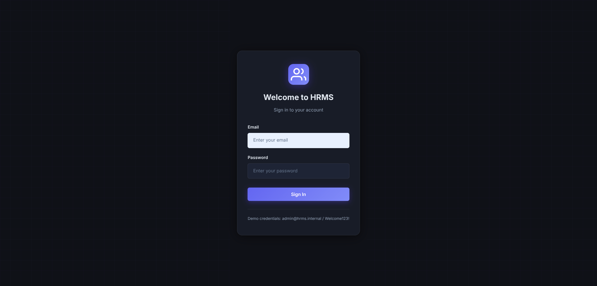

3. Enter your **Email** address assigned by your administrator
4. Enter your **Password**
5. Click the **Sign In** button

> **Note**: If you forget your password, contact your HR administrator for a reset.

---

## 2. Dashboard

The Dashboard is the default page after logging in. It provides an overview of your organization.

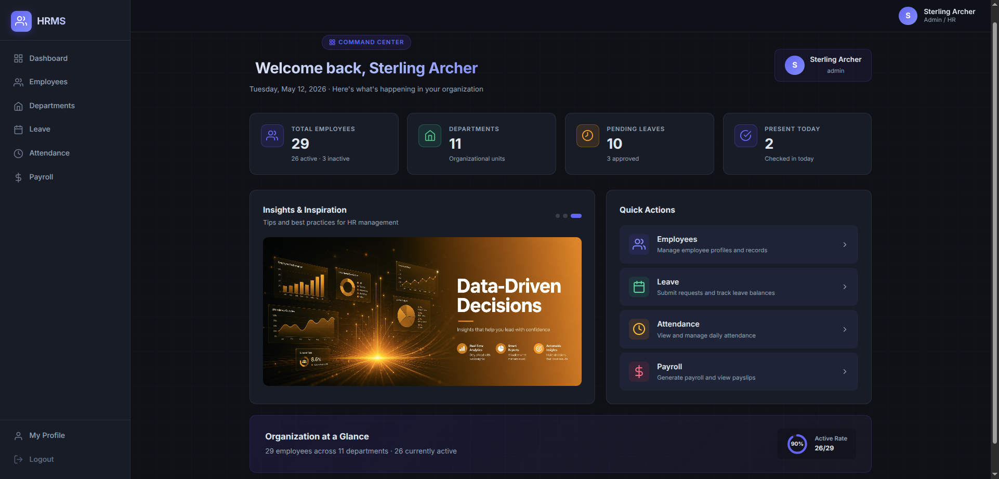

### 2.1 Welcome Header

- The header displays **"Welcome back, [Your Full Name]"** with today's date
- Your profile avatar (initial letter of your name) and role are shown in the top-right card

### 2.2 Statistics Overview (Admin Only)

Admin users see four stat cards at the top:

| Card | Description |
|------|-------------|
| **Total Employees** | Total count of all employees (active + inactive) |
| **Departments** | Number of organizational units |
| **Pending Leaves** | Number of leave requests awaiting approval |
| **Present Today** | Number of employees who checked in today |

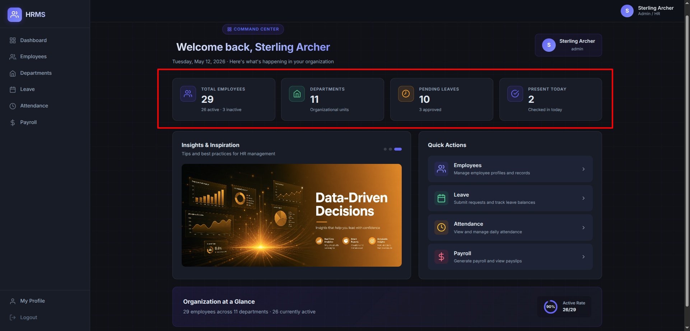

> **Note**: Manager and Employee roles do not see these stat cards.

### 2.3 Quick Actions

Four shortcut cards provide quick navigation to main sections:

| Action | Destination | Description |
|--------|-------------|-------------|
| **Employees** | `/employees` | Manage employee profiles and records |
| **Leave** | `/leave` | Submit requests and track leave balances |
| **Attendance** | `/attendance` | View and manage daily attendance |
| **Payroll** | `/payroll` | Generate payroll and view payslips |

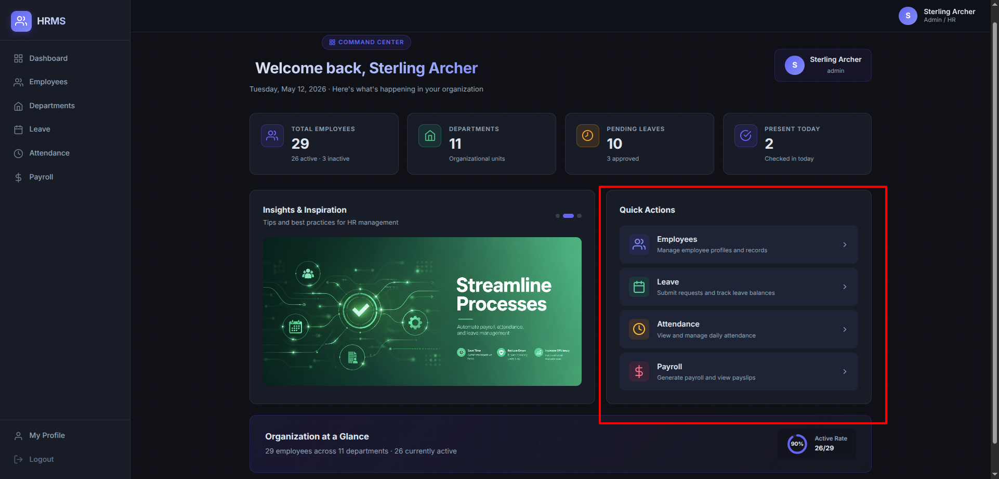

**To use Quick Actions:**
1. Click the card you want to navigate to
2. You will be redirected to the corresponding page

### 2.4 Image Carousel

- Displays motivational/inspirational images that auto-rotate every 4 seconds
- Click the **dot indicators** below the image to manually switch slides

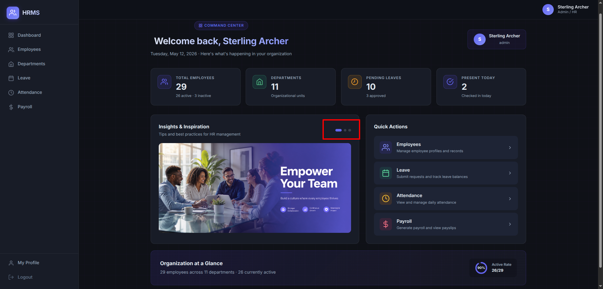

### 2.5 Organization at a Glance (Admin Only)

- Shows total employees, departments, and active count
- Displays an **Active Rate** ring chart (percentage of active employees)

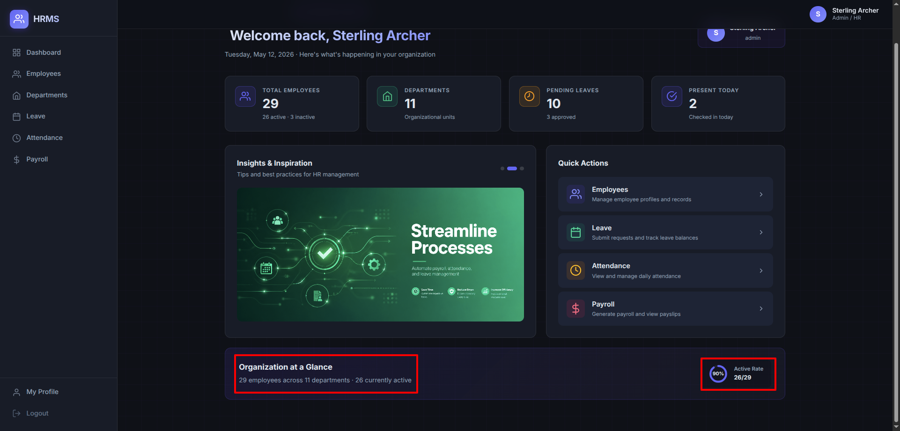

---

## 3. Employees

> **Access**: Admin (full), Manager (view-only)

### 3.1 Viewing Employee List

1. Click **Employees** from the sidebar or Dashboard Quick Actions
2. The employee list page loads with three stat cards at the top:
   - **Total Employees**: Total count
   - **Active**: Number of active employees
   - **Inactive**: Number of inactive employees

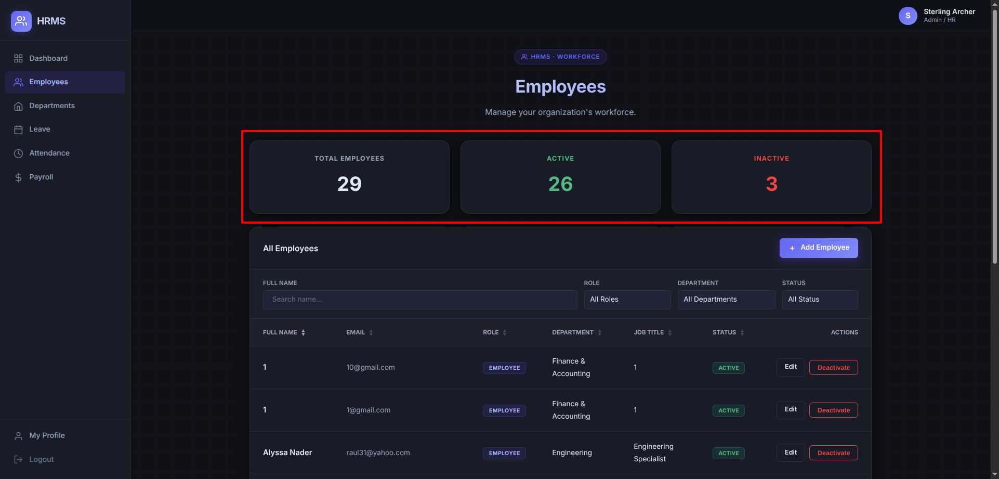

3. Below the stats, the **All Employees** table displays all employee records

### 3.2 Filtering Employees

The filter bar above the table allows you to narrow down the employee list:

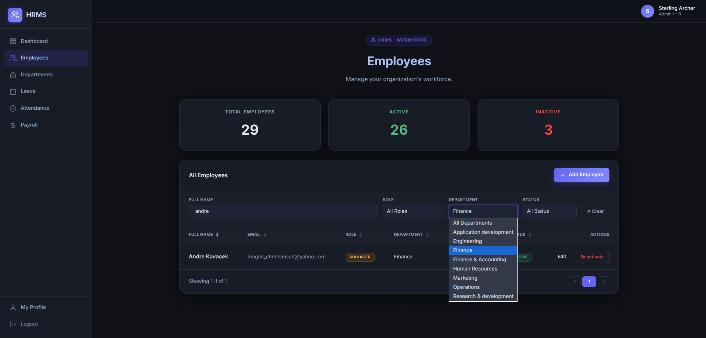

| Filter | How to Use |
|--------|-----------|
| **Full Name** | Type part of an employee's name to search |
| **Role** | Select a role: HR, Manager, or Employee |
| **Department** | Select a specific department |
| **Status** | Select Active or Inactive |

**Steps:**
1. Enter/select filter criteria in any of the four fields
2. Results update automatically
3. Click **✕ Clear** to reset all filters

### 3.3 Sorting Columns

Click any column header to sort the table:

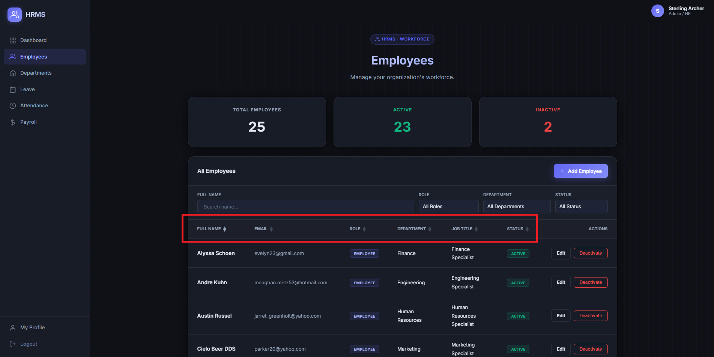

| Column | Sort Key |
|--------|----------|
| Full Name | Alphabetically by name |
| Email | Alphabetically by email |
| Role | By role type |
| Department | Alphabetically by department name |
| Job Title | Alphabetically by job title |
| Status | Active/Inactive |

- **First click**: Sort ascending (A→Z)
- **Second click**: Sort descending (Z→A)
- The active sort column shows highlighted arrow indicators (▲▼)

### 3.4 Creating a New Employee (Admin Only)

1. Click the **Add Employee** button in the top-right of the table header

   
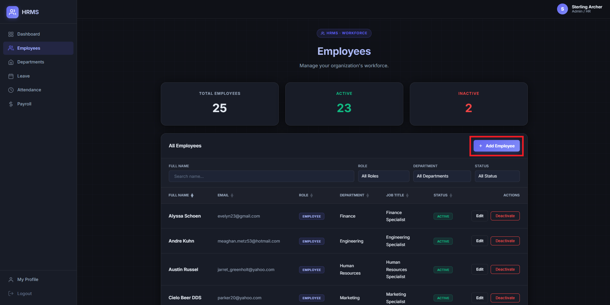

2. The **Create Employee** form appears with the following fields:

   
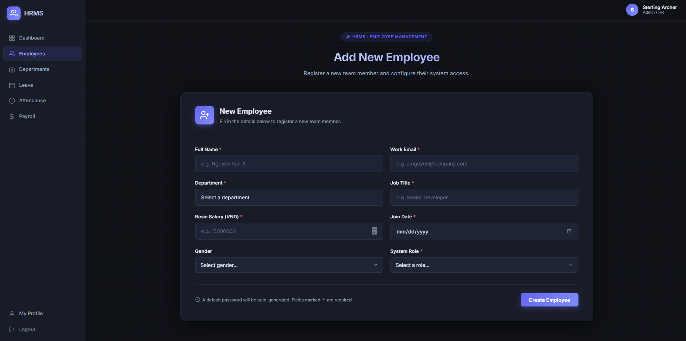

| Field | Type | Required | Description |
|-------|------|----------|-------------|
| **Full Name** | Text | ✅ | Employee's full legal name |
| **Email** | Email | ✅ | Work email address (must be unique) |
| **Phone** | Text | ❌ | Contact phone number |
| **Address** | Text | ❌ | Residential address |
| **Position** | Text | ✅ | Job title/position |
| **Department** | Dropdown | ✅ | Select from available departments |
| **Role** | Dropdown | ✅ | ADMIN_HR, MANAGER, or EMPLOYEE |
| **Gender** | Dropdown | ❌ | Male, Female, or Other |
| **Basic Salary** | Number | ✅ | Monthly basic salary (VND) |
| **Experience** | Number | ❌ | Years of experience |
| **Email CC** | Email | ❌ | Secondary email for notifications |

3. Fill in all required fields
4. Click **Create** to save the new employee
5. You will be redirected to the employee list page

### 3.5 Editing an Employee (Admin Only)

1. In the employee table, locate the employee you want to edit
2. Click the **Edit** button in the **Actions** column

   
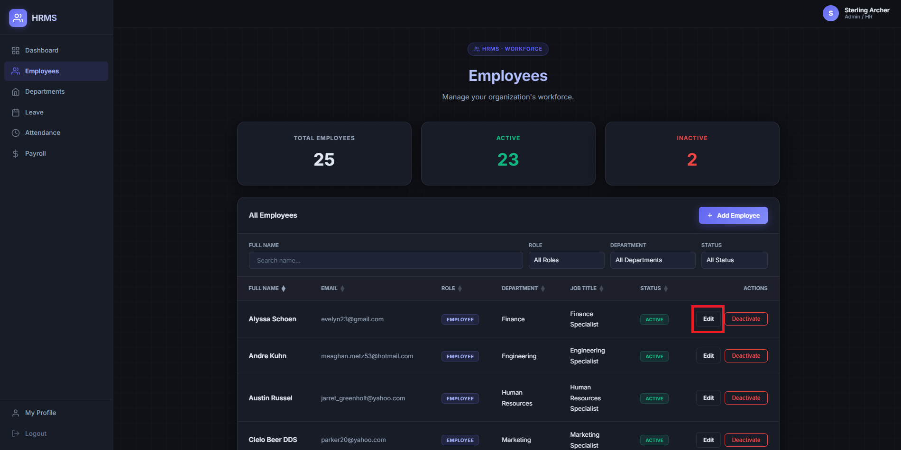

3. Modify any field in the form
4. Click **Save Changes** to update the record

### 3.6 Deactivating an Employee (Admin Only)

1. In the employee table, locate the active employee
2. Click the **Deactivate** button in the **Actions** column

   
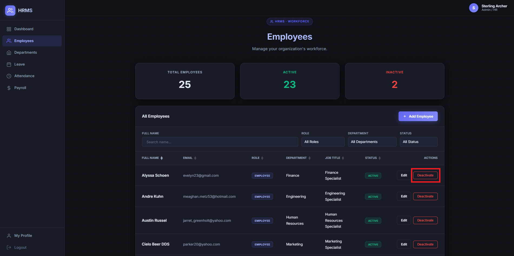

3. The employee's status changes to **Inactive** immediately
4. A success message appears: "Employee deactivated successfully!"

> **Note**: Deactivated employees retain all their data but are marked as inactive.

### 3.7 Pagination

When there are more than 10 employees, use pagination controls at the bottom of the table:

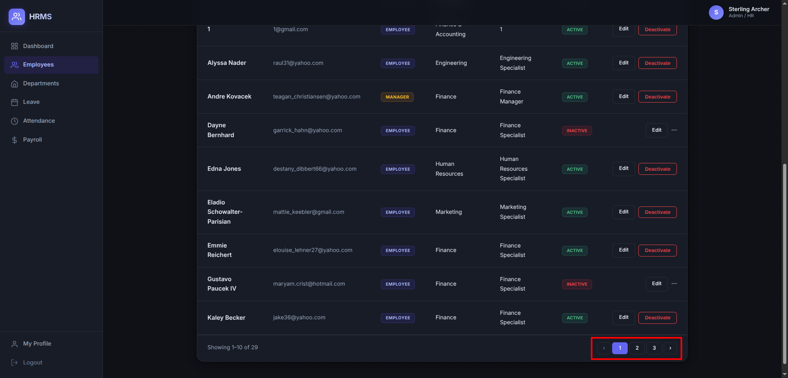

- **Page numbers**: Click to jump to a specific page
- **Ellipsis (...)**: Indicates skipped page numbers
- **‹**: Go to previous page
- **›**: Go to next page
- **"Showing X–Y of Z"**: Displays current range and total count

---

## 4. Departments

> **Access**: Admin (view), Manager (view)

### 4.1 Viewing Department List

1. Click **Departments** from the sidebar
2. The department list page loads with stat cards at the top:
   - **Total Departments**: Number of departments
   - **Total Employees**: Employees assigned to departments
   - **Largest Department**: Department with most employees

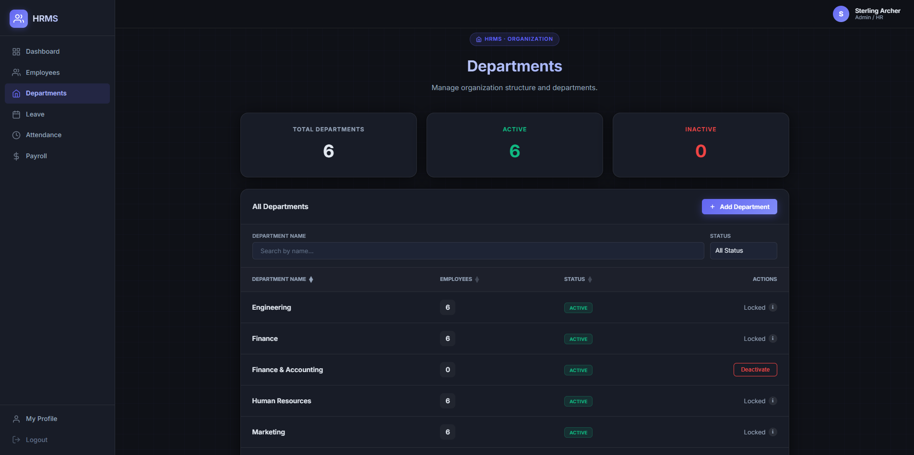

### 4.2 Department Statistics

Below the stat cards, the department table displays:

| Column | Description |
|--------|-------------|
| **Department** | Department name |
| **Employees** | Number of employees in the department |
| **Workforce Ratio** | Percentage of total workforce (with progress bar) |
| **Employees List** | Scrollable list of employee full names |

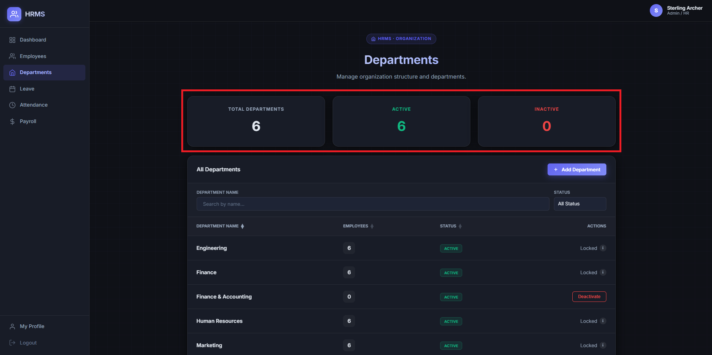

> **Note**: Department management (create/edit/delete) is currently handled by the system administrator.

---

## 5. Leave Management

> **Access**: All roles (different features per role)

### 5.1 Submitting a Leave Request (Employee)

1. Click **Leave** from the sidebar or Dashboard
2. The Leave page loads with the **Submit a Leave Request** form on the left

   
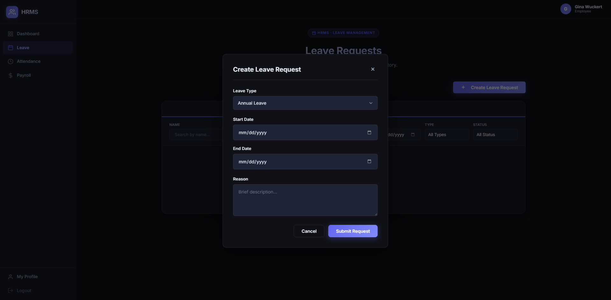

3. Fill in the form:

| Field | Description |
|-------|-------------|
| **Leave Type** | Select: Annual, Sick, or Unpaid |
| **Start Date** | First day of leave (inclusive) |
| **End Date** | Last day of leave (inclusive) |
| **Reason** | Brief explanation for the leave request |

4. Your **Leave Balance** is displayed on the right showing remaining Annual Leave days
5. Click **Submit Request**

> **Note**: Leave requests are automatically sent to your manager for approval.

### 5.2 Viewing Leave Requests (Admin/Manager)

1. Click **Leave** from the sidebar
2. The page displays three sections:

#### Leave Requests Table

Shows all leave requests with filtering options:

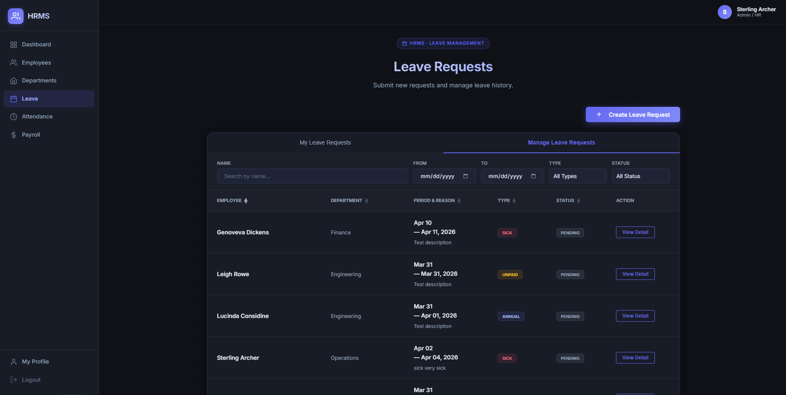

| Filter | Options |
|--------|---------|
| **Employee** | Search by employee name |
| **Leave Type** | All Types, Annual, Sick, Unpaid |
| **Status** | All Status, Pending, Approved, Rejected |

#### Leave Report

Shows leave usage statistics for a selected month/year:

| Column | Description |
|--------|-------------|
| **Employee** | Employee full name |
| **Annual** | Number of annual leave days used |
| **Sick** | Number of sick leave days used |
| **Unpaid** | Number of unpaid leave days used |
| **Total** | Total leave days used |

#### Leave Analytics

Visual chart showing leave distribution across employees:

### 5.3 Approving/Rejecting Leave Requests (Admin/Manager)

1. In the Leave Requests table, locate the pending request
2. Click the **✓ (Approve)** or **✕ (Reject)** button in the **Actions** column

   
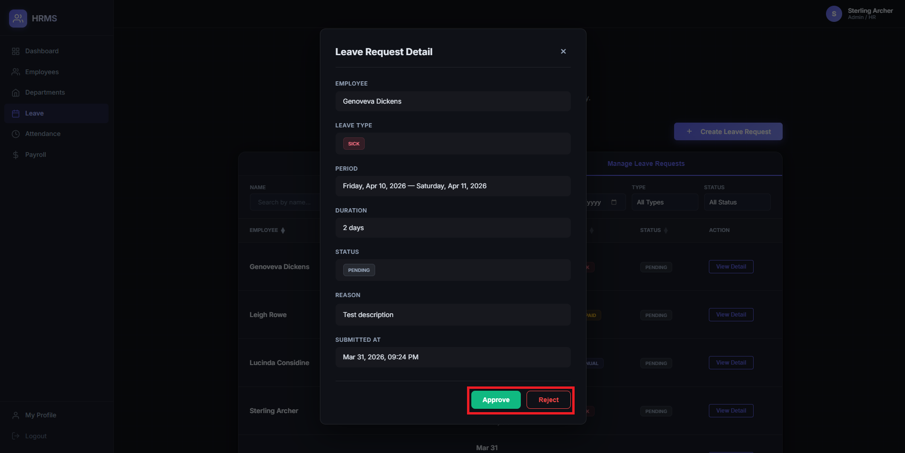

3. The status updates immediately:
   - **Approved**: Employee is notified, leave is recorded
   - **Rejected**: Employee is notified, leave is not deducted

> **Note**: Only requests with status "Pending" can be approved or rejected.

### 5.4 Leave Report

1. Scroll to the **Leave Report** section
2. Select a **Month** and **Year** using the filter dropdowns
3. The report updates showing leave usage for that period

### 5.5 Leave Analytics

- The bar chart displays leave days per employee
- Each bar is color-coded by leave type:
  - **Green**: Annual Leave
  - **Blue**: Sick Leave
  - **Gray**: Unpaid Leave

---

## 6. Attendance

> **Access**: All roles

### 6.1 Checking In / Checking Out

1. Click **Attendance** from the sidebar or Dashboard
2. The attendance page loads with Check In / Check Out buttons at the top

   
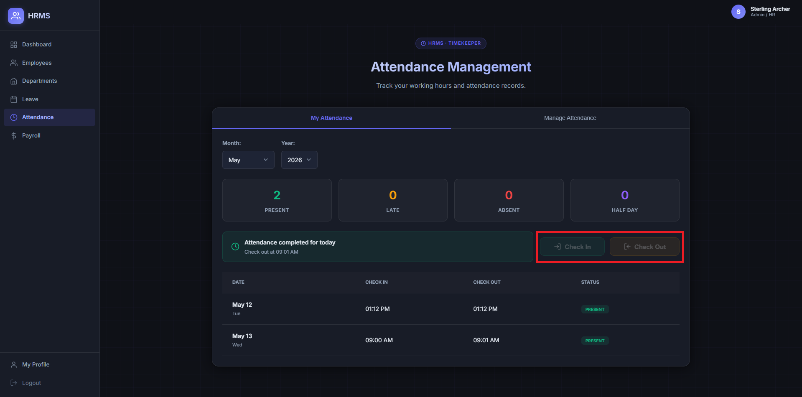

**To Check In:**
1. Click the **Check In** button
2. The system records your check-in time automatically
3. The button state changes to show you are checked in

**To Check Out:**
1. Click the **Check Out** button at the end of your workday
2. The system records your check-out time automatically

> **Note**: Check-in and check-out times are used for payroll calculations.

### 6.2 Viewing Attendance Records

**Employee role:**
- View only your own attendance records
- Filter by date range using the date picker

**Admin/Manager role:**
- View all employee attendance records
- Filter by:
  - **Employee Name**: Search by name
  - **Date**: Select specific date
  - **Date Range**: Select start and end dates

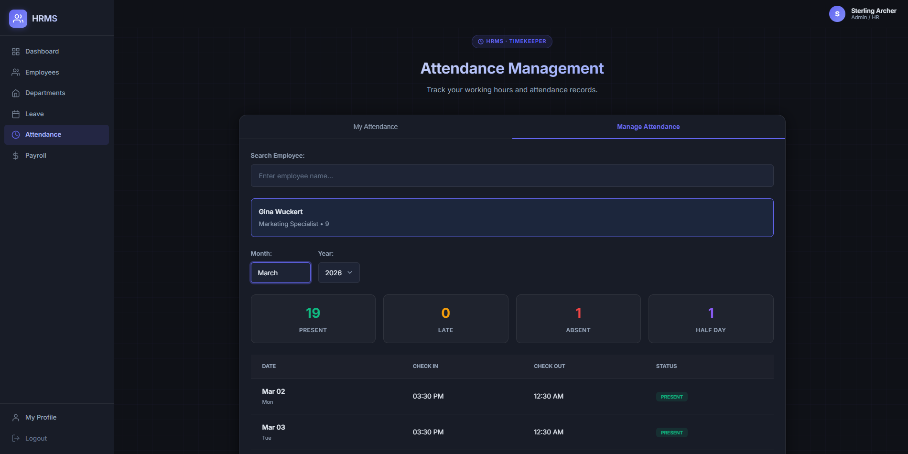

| Column | Description |
|--------|-------------|
| **Employee** | Employee full name |
| **Date** | Attendance date |
| **Check In** | Check-in time |
| **Check Out** | Check-out time (if checked out) |
| **Status** | Present, Absent, or Late |

---

## 7. Payroll

> **Access**: Admin (full), Manager (view), Employee (own payslip only)

### 7.1 Generating Payroll (Admin Only)

1. Click **Payroll** from the sidebar
2. Locate the **Generate Payroll** form on the right side

   
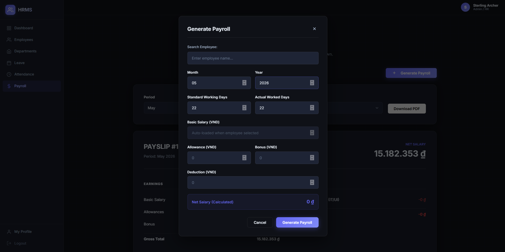

3. Fill in the form:

| Field | Description |
|-------|-------------|
| **Employee** | Click **Search Employee** to open the dropdown, then select an employee |
| **Month** | Select the payroll month (e.g., January 2026) |
| **Year** | Auto-filled based on month selection |
| **Working Days** | Number of working days in the month (auto-calculated) |
| **Attendance Days** | Actual days attended (auto-filled from attendance records) |
| **Leave Days** | Approved leave days (auto-filled from leave records) |
| **Basic Salary** | Auto-filled from employee's salary record (read-only) |

4. Click **Generate** to create the payroll record

> **Note**: Basic Salary, Working Days, Attendance Days, and Leave Days are auto-populated. Only Employee and Month need manual selection.

### 7.2 Viewing Payroll Records

1. The payroll table lists all generated payroll records
2. Filter by **Month** and **Year** using the dropdowns

   
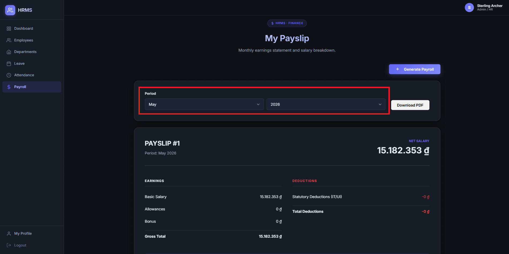

| Column | Description |
|--------|-------------|
| **Employee** | Employee full name |
| **Month/Year** | Payroll period |
| **Basic Salary** | Base monthly salary |
| **Attendance Days** | Days attended |
| **Net Pay** | Final payable amount after deductions |

---

## 8. My Profile

> **Access**: All roles

### 8.1 Viewing Your Profile

1. Click **My Profile** from the sidebar
2. Your personal information is displayed:

   
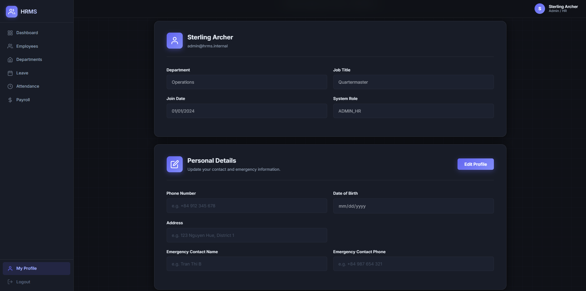

| Field | Description |
|-------|-------------|
| **Full Name** | Your full name |
| **Email** | Your work email |
| **Phone** | Your contact phone |
| **Department** | Your assigned department |
| **Position** | Your job title |
| **Role** | Your system role (Admin/Manager/Employee) |
| **Status** | Active or Inactive |
| **Join Date** | Your hire date |

> **Note**: Profile information is managed by the HR administrator. Contact them for any changes.

---

## 9. FAQ

### Q: I forgot my password. How do I reset it?
**A**: Contact your HR administrator to reset your password.

### Q: Can I edit my own profile?
**A**: No. Profile information is managed by the HR administrator.

### Q: Why can't I see the "Add Employee" button?
**A**: Only Admin (HR) users can create new employees. Managers have view-only access.

### Q: How are leave balances calculated?
**A**: Annual leave balance is based on your employment contract and decreases when leave is approved.

### Q: What happens if I forget to check out?
**A**: Your check-out time will show as "—" in the attendance records. Contact HR to manually correct it.

### Q: Can I view payroll for other employees?
**A**: Managers can view all payroll records. Employees can only view their own payslips.

### Q: Why is the Basic Salary field grayed out in the payroll form?
**A**: Basic Salary is auto-filled from the employee's salary record and cannot be manually edited to ensure accuracy.

---

## 10. Glossary

| Term | Definition |
|------|-----------|
| **Admin (HR)** | Full system administrator with all permissions |
| **Manager** | Department supervisor with view and approval permissions |
| **Employee** | Regular staff member with limited self-service access |
| **Active** | Employee status indicating currently employed |
| **Inactive** | Employee status indicating no longer employed |
| **Working Days** | Standard working days in a pay period |
| **Net Pay** | Final salary after all deductions |
| **Leave Balance** | Remaining annual leave days available |
| **Attendance Days** | Actual days the employee was present at work |

---

## Appendix A: Navigation Quick Reference

| Page | Sidebar Icon | URL | Access |
|------|-------------|-----|--------|
| Dashboard | 🏠 Home | `/` | All roles |
| Employees | 👥 Team | `/employees` | Admin, Manager |
| Departments | 🏢 Building | `/departments` | Admin, Manager |
| Leave | 📋 Clipboard | `/leave` | All roles |
| Attendance | ⏱ Clock | `/attendance` | All roles |
| Payroll | 💰 Dollar | `/payroll` | All roles |
| My Profile | 🛡️ Shield | `/profile` | All roles |

---

## Appendix B: Keyboard Shortcuts

| Shortcut | Action |
|----------|--------|
| `Ctrl + F` | Focus on search/filter input (when available) |
| `Escape` | Close modal dialogs |

---

*Document Version: 1.0*
*Last Updated: May 2026*
*For questions or feedback, contact your HR administrator.*